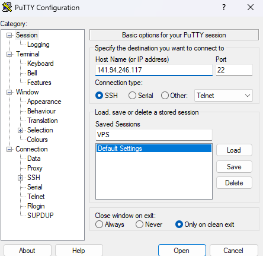
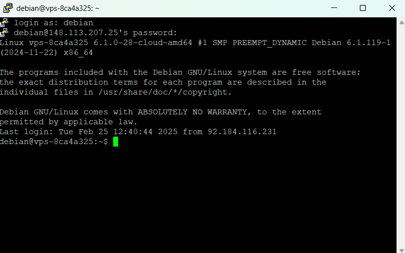
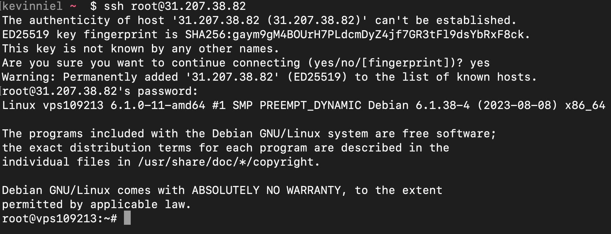
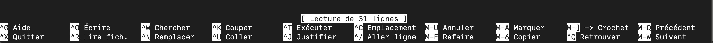
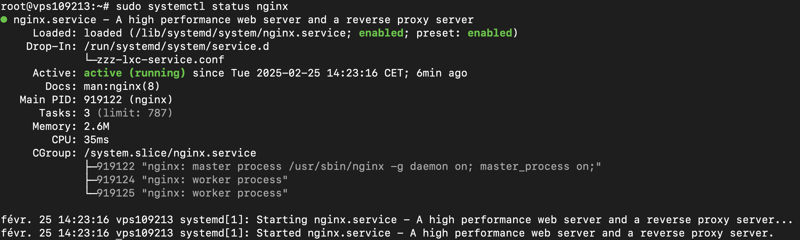
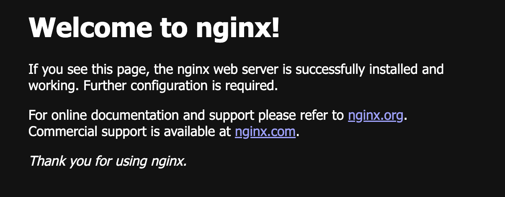
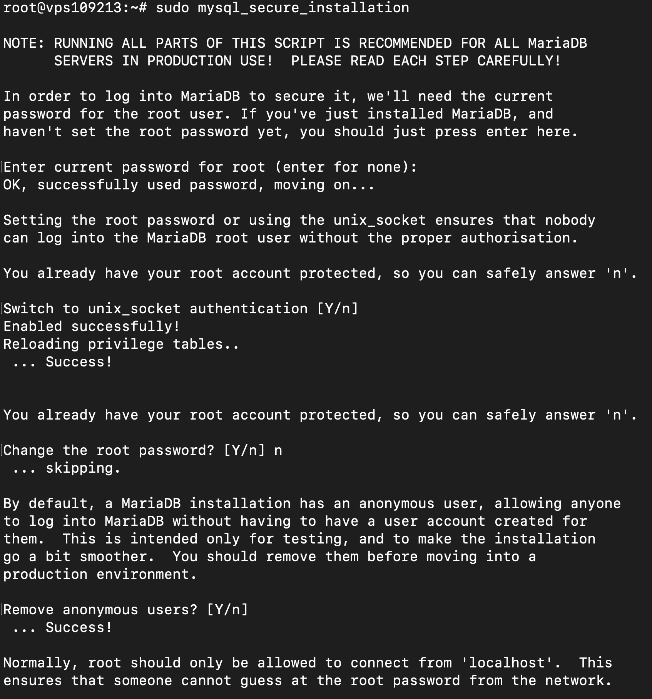
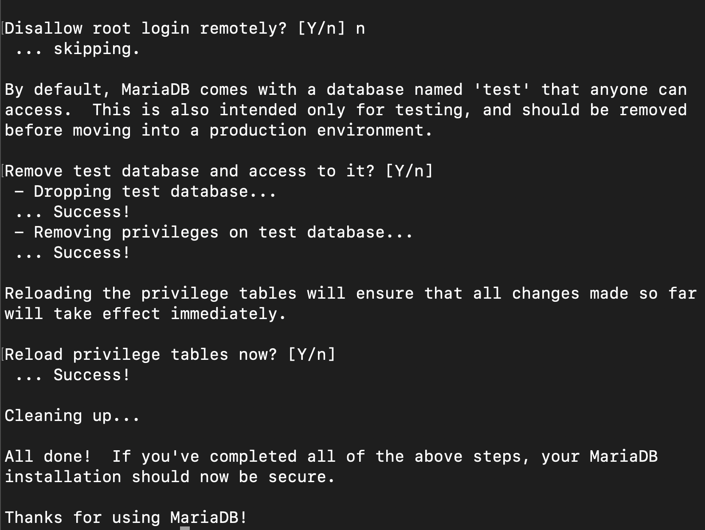
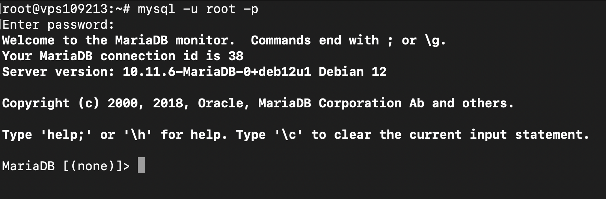

# Installation VPS

eliane.perol.angers.mds-project.fr    31.207.38.82    H64yPZYBH7l

## Prérequis

- un VPS
- un nom de domaine si possible
- Debian 12 vierge (installé sur le VPS)

## Informations globales

- Pour fermer une tâche en cours dans un terminal, il faut faire `ctrl + c`.

## Préparation à la connexion en ssh

- sur windobe (putty) : https://www.chiark.greenend.org.uk/~sgtatham/putty/latest.html
- sur noyaux unix -> CLI (déjà dispo)

ℹ️ sur windows, pour coller un contenu que vous avez copier depuis votre ordi, utilisez le clic droit. Pensez à positionner le curseur om vous le souhaitez avant.

## Connexion au ssh

- les users "superadmin" s'apellent en général "root".
- Lorsque vous avez un VPS qui vient de chez OVH, il s'appelle "debian"

‼️ pensez bien à adapter pour la suite, dans ce tuto, j'utiliserai "root".

### putty

- Ne pas toucher au port "22"
- renseigner l'adresse IP (v4) de votre serveur dans la barre prévue à cet effet :

- Appuyez sur "open"
- si une fenêtre d'alerte arrive, appuyez sur "accepter"
- renseignez le user (debian / root etc...) et le mot de passe


ℹ️ Parfois Putty plante. Le titre de l'application verra "(inactive)" apparaître. Si ça vous arrive, relancez putty (ou achetez un mac 💻)


### CLI

Tapez la commande suivante : (en remplacant par vos informations petits boulets 😇)
```
ssh user@ip
```



## Configurer les raccourcis

- Ajouter dans le fichier `.bashrc`, à la racine de votre utilisateur (pour y accéder, tapez : `cd`)
- Éditez le fichier en tapant la commande `sudo nano .bashrc`

```
alias c='clear'
alias l='ls'
alias ll='ls -al'
alias .='cd ..'
alias ..='cd ../..'
alias ...='cd ../../..'
alias ....='cd ../../../..'
alias .....='cd ../../../../..'
alias ......='cd ../../../../../..'
```

ℹ️ `nano` est un éditeur de texte (IDE) en CLI. Le menu de navigation des commandes de nano est en bas de l'écran. Le symbole `^` correspond à votre touche de clavier "control". 


## Installer le serveur web

ℹ️ Il est possible de chaîner les commandes CLI en les séparants par les symboles ```&&```

### Mettre à jour les paquets du serveur

```
sudo apt update && sudo apt upgrade -y
```

### Nginx

C'est notre serveur web, qui va exécuter le code web. (c'est pareil que MAMP, WAMP, XAMPP, Laragon etc...)

- Installation : `sudo apt install nginx -y`
- autoriser nginx : `sudo systemctl enable nginx`
- lancer nginx : `sudo systemctl start nginx`
- vérifier le statut de nginx : `sudo systemctl status nginx` (tout doit être en vert)



A la fin de l'installation, si vous entrez l'ip de votre serveur dans le navigateur, vous devriez avoir un message "Welcome to Nginx" : 



### Base de données

- Installation de MariaDB (= MySQL) : `sudo apt install mariadb-server mariadb-client -y`
- Sécuriser la BDD : `sudo mysql_secure_installation`

ℹ️ Le mot de passe de base de l'utilisateur `root` est : `` (vide, rien, nada...)
ℹ️ Lorsqu'il n'y a rien sur les screens en dessous, c'est qu'il ne faut rien mettre 😇





- ℹ️ Pour tester si l'installation de MariaDB s'est exécutée correctement, il faut s'y connecter avec la commande : `mysql -u root -p`.
‼️ Il faut bien utiliser ici "root", et non debian ou autre. Il s'agit de l'utilisateur base de donnée et non celui de votre machine.
- ℹ️ Le mot de passe est vide. Quand on vous le demande, ne mettez rien et tapez sur "entrer".
- ℹ️ pour ceux qui ont le message "access denied", mettez "sudo" devant votre commande : `sudo mysql -u root -p`.
- ℹ️ pour quitter l'interface "mysql", tapez la commande : `exit;`



### Installer les dépendances nécessaires

#### GIT

`sudo apt install git -y`

#### PHP & dépendances

- `sudo apt install php php-cli php-fpm php-mysql php-zip php-xml php-bcmath php-curl php-mbstring unzip curl -y`
- `sudo apt install php8.2-fpm -y`
- `sudo systemctl start php8.2-fpm`
- `sudo systemctl enable php8.2-fpm`
- `sudo systemctl status php8.2-fpm`

#### Virer apache2 

- `sudo systemctl stop apache2`
- `sudo systemctl disable apache2`
- `sudo apt remove --purge apache2 apache2-utils apache2-bin apache2.2-common -y`
- `sudo rm -rf /etc/apache2`
- `sudo apt autoremove -y`
- `sudo apt autoclean`

### Installer PhpMyAdmin

On va prendre le lien de téléchargement du PHP et le télécharger.

- se positionner dans le dossier à la racine du serveur web : `cd /var/www/html`
- télécharger le dossier zippé : `wget https://files.phpmyadmin.net/phpMyAdmin/5.2.2/phpMyAdmin-5.2.2-all-languages.zip`
- dézipper le fichier : `unzip phpMyAdmin-5.2.2-all-languages.zip`
- virer le .zip : `rm phpMyAdmin-5.2.2-all-languages.zip`
- renommer le dossier en phpMyAdmin : `mv phpMyAdmin-5.2.2-all-languages/ phpMyAdmin`

### Créer un utilisateur MySQL pour accéder à phpMyAdmin

- se connecter à MySQL : `mysql -u root -p`
- créer un utilisateur : `CREATE USER 'nom_utilisateur'@'localhost' IDENTIFIED BY 'mot_de_passe';`
- lui donner tous les droits : `GRANT ALL PRIVILEGES ON *.* TO 'nom_utilisateur'@'localhost' WITH GRANT OPTION;`
- flush les privileges : `FLUSH PRIVILEGES; EXIT;`

## Paramétrer les DNS

RDV sur votre gestionnaire de NDD, et créez autant d'entrées de type "A" que nécessaire (avec des sous-domaines par exemple) pointant vers l'adresse IP de votre serveur (laissez les paramètres par défaut !).

## Configurer nginx pour qu'il renvoi le bon site sur la bonne URL

Les fichiers de configurations nginx sont dans le dossier `/etc/nginx/sites-available`
ATTENTION, ICI TOUS LES CODES SONT SPÉCIFIQUE À MON CAS DE FIGURE. PENSEZ À ADAPTER À VOTRE SITUATION.

- `cd /etc/nginx/sites-available`
- créer le fichier de conf : `sudo nano btspma.kevinniel.fr.conf`
- y place le contenu suivant, en remplacant les valeurs nécessaires (`$fulldomain`)

ℹ️ `$fulldomain` correspond à l'url d'entrée dans votre application. si c'est "toto.fr", alors remplacez le par "toto.fr". Si c'est "pma.toto.fr", remplacez le par "pma.toto.fr".
ℹ️ `$fulldomain.conf` est souvent utilisé comme nom de fichier de conf.
‼️ Vous devez virer le symbole `$` !!!

```
server {
    # défini le nom de domain à partir duquel le fichier de conf doit être pris en compte
    server_name $fulldomain;
    # chemin qu'on doit exécuter quand ce fichier de conf est appelé.
    # Attention, on doit pointer vers un dossier, et non un fichier
    root /var/www/html/$fulldomain;

    access_log  /var/log/nginx/$fulldomain.access.log;
    error_log  /var/log/nginx/$fulldomain.error.log;

    fastcgi_buffers 16 16k;
    fastcgi_buffer_size 32k;

    # Security / XSS Mitigation Headers
    add_header X-Frame-Options \"SAMEORIGIN\";
    add_header X-XSS-Protection \"1; mode=block\";
    add_header X-Content-Type-Options \"nosniff\";

    # Ordre dans lequel nginx va aller chercher à exécuter les fichiers si existants
    # dans le dossier dans lequel on a pointé
    index index.html index.htm index.php;

    location / {
        # ici, pensez à virer les backslash !
        try_files $uri $uri/ /index.php?$query_string;
    }

    location ~ \.php$ {
        fastcgi_pass unix:/var/run/php/php8.2-fpm.sock;
        fastcgi_index index.php;
        fastcgi_param SCRIPT_FILENAME \$realpath_root\$fastcgi_script_name;
        include fastcgi_params;
    }

    location ~ /\.(?!well-known).* {
        deny all;
    }
}
```

ℹ️ Si vous avez une erreur du type "unknown directive mode=block", commentez ou supprimez le bloc suivant du fichier de conf nginx : 
```
    # Security / XSS Mitigation Headers
    add_header X-Frame-Options \"SAMEORIGIN\";
    add_header X-XSS-Protection \"1; mode=block\";
    add_header X-Content-Type-Options \"nosniff\";
```


- activer le fichier de configuration en créant un lien symbolique : `sudo ln -s /etc/nginx/sites-available/btspma.kevinniel.fr.conf /etc/nginx/sites-enabled/`
- Vérifier que ça fonctionne avec `sudo nginx -t`, qui doit afficher : 
```
nginx: the configuration file /etc/nginx/nginx.conf syntax is ok
nginx: configuration file /etc/nginx/nginx.conf test is successful
```
- redémarrer le service nginx : `sudo service nginx restart`

## Mise en place du HTTPS

- Installation de certbot : `sudo apt install certbot python3-certbot-nginx -y`
- Génération du certificat SSL : `sudo certbot --nginx -d NOM_DE_DOMAINE`

## Pour déployer une application à partir de git

- Vérifiez que GIT est bien installé : `git --version`
- Rendez-vous dans le dossier où vous souhaitez déployer votre application

## pour automatiser le déploiement

- Créer un dossier `.github` à la racine de votre projet
- Créer un dossier `workflows` dans le dossier `.github`
- Créer un fichier `ci.yml` dans le dossier `workflows`

Vous devriez arriver à ce chemin : `.github/workflows/ci.yml`

Renseignez ce contenu dans le fichier `ci.yml` : 

```
name: CI

on: [push]

jobs:
  deploy:
    if: github.ref == 'refs/heads/master'
    runs-on: ubuntu-latest
    steps:
      - uses: actions/checkout@v2
      - name: Push to server
        uses: appleboy/ssh-action@master
        with:
          host: ${{ secrets.SERVER_IP }}
          username: ${{ secrets.SERVER_USERNAME }}
          password: ${{ secrets.SERVER_PASSWORD }}
          script: |
            cd ${{ secrets.PROJECT_PATH }}
            sudo git pull
```

Allez paramétrer les 4 variables "secrets" dans github : 
- Allez dans l'onglet "settings" de votre repository
- Allez dans "Secrets and Variables", puis "actions"
- Cliquez sur "New repository secret" et renseignez les bonnes valeurs

Vous devriez maintenant avoir le déploiement se faire dans l'onglet "Actions" de votre repository.

Si jamais cela ne se déclenche pas et que vous êtes sûr à 100% des valeurs de vos secrets, allez vérifier dans l'onglet "Settings -> Actions -> General" que la première ligne "Allow all actions and reusable workflows" est bien sélectionnée.


## Erreurs communes

- Vérifiez que votre fichier de config nginx ait bien un nom se terminant par ".conf"
- Vérifier que dans votre fichier de conf, la route de la ligne "root" pointe bien vers un dossier. Et que ce dossier contienne bien un fichier "index.html" ou "index.php"


## TODO

- Déployer phpMyAdmin avec HTTPS
- Déployer votre portfolio avec HTTPS
- Déployer l'application Laravel avec HTTPS
